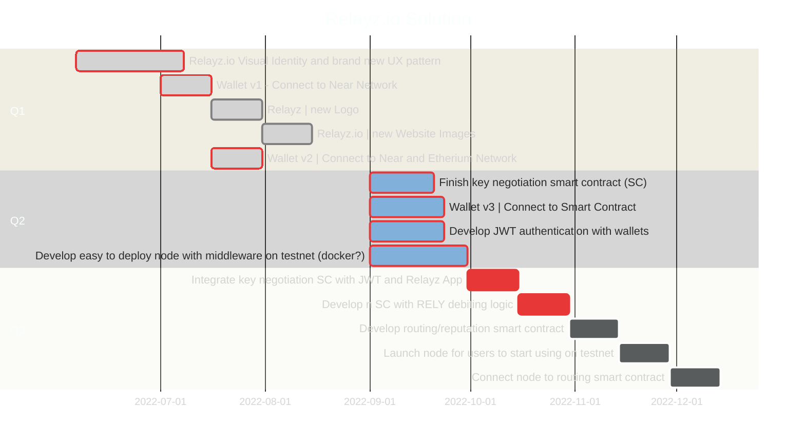
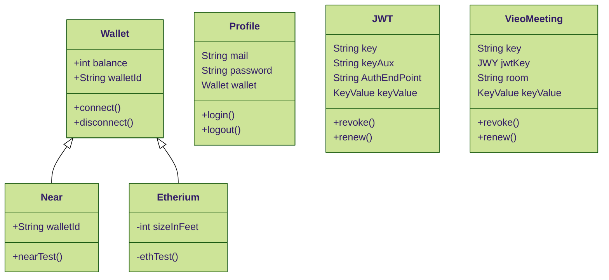

# Relayz API | Node.js 
- Diagrams
  - [Milestones](#Milestons)
  - [Entities](#Entities)
    - JWT Authentication
    - History
    - Wallet (todo)
    - Cryipto (todo)
  - Architecture
- [DevOps](#DevOps)
  - Install
  - Configure
- [Swagger](#Swagger)
  - Path
  - Exemples


## Milestons


## Entities



# DevOps 
##### Link: [Reference]( https://tibbo.com/linux/nodejs/service-file.html)

## How to Install
- Create the file `relayz-api.service` with the following contents:
- copy this file to `/lib/systemd/system/`

> ***In this project this file on***  `./ops/deploy/relayz-api.service`

Require:
intall 
sudo apt install nodejs npm
go to path and run
npm i


sudo ufw allow 4443/tcp
sudo ufw allow 3000/tcp
sudo ufw enable

```
# Unit
Description=Relayz API NodeJS Application
After=network-online.target

#Service
Restart=on-failure
WorkingDirectory=/opt/node-apps/demo0/site/
ExecStart=/usr/bin/node /opt/node-apps/demo0/site/app.js
WantedBy=multi-user.target
```
Save it and copy to `/lib/systemd/system/`.
## Run this command:
```
systemctl daemon-reload
```
Let SystemD know about the relayz-api service and instruct SystemD to load this service on boot:
```
systemctl enable relayz-api
```
Now run the relayz-api service:
```
systemctl restart relayz-api
```
```That's it!```

Anything your new relayz-api service outputs to the error or standard output stream will be redirected to the system journal. So, if something goes wrong you may use our System Journal Web Viewer to see the stack trace messages generated by Node.js exception handlers or console.log() output.

You may also find it convenient to see journaled messages directly in the CLI (To cancel this from the journal reader, press `CTRL+C`):
```
journalctl -lf -u relayz-api
```
To stop the service:
```
systemctl stop relayz-api
```
To disable the service (prevent it from loading on boot):
```
systemctl disable relayz-api
```
To see the status of your service:
```
systemctl status relayz-api
```
You may also want to set the main working directory for your service and limit the resources it takes from the OS:
## Unit
```
Description=LTPS NodeJS Test Application
After=network-online.target
```

## Service 
```
Restart=on-failure
```
do chdir before running the service
```
WorkingDirectory=/opt/node-apps/demo0/site/
ExecStart=/usr/bin/node app.js
```
limit CPU and RAM quota for our service**
```
CPUAccounting=true
CPUQuota=10%
MemoryAccounting=true
MemoryLimit=50M
```

Install
```
WantedBy=multi-user.target
````

# Swagger

##### Link: [Automatic API Documentation](https://medium.com/swlh/automatic-api-documentation-in-node-js-using-swagger-dd1ab3c78284)
##### Link: [Swagger Editor - Online]( https://editor.swagger.io/)
##### Link: [Exemple](https://github.com/satansdeer/swagger-api-library/blob/master/routes/books.js)

(todo)

# Testing to save data Video Bridge in MongoDB - Locally (route /videobridge/save)
Run a script to raise MongoDB server in Docker
- docker-compose up --force-recreate -d
- In the browser, access URL http://localhost:8081/ to view mongo express dashboard

user: relayz
pass: relayz
